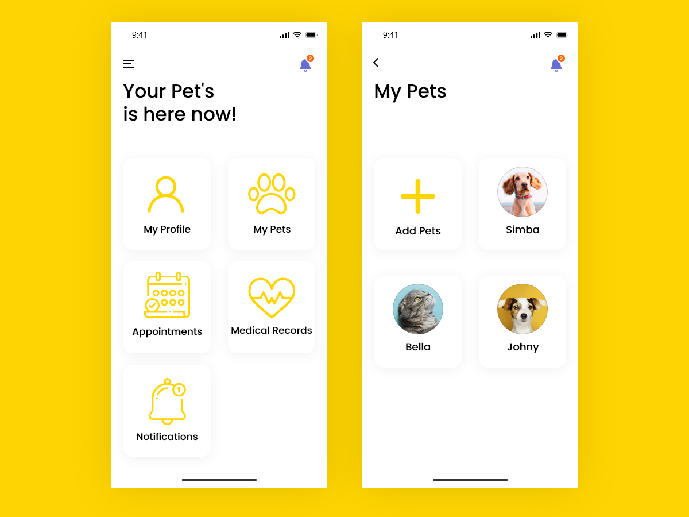

<<<<<<< HEAD
# 🐶 Flutter Pet Clinic App

This repo contains a Flutter based app inspired by the beautiful design made by *Atul Dhone*, shared on Uplabs, see: [Uplabs Pet Clinic](https://www.uplabs.com/posts/pet-clinic).

This three page-app contains small cards. Which are reusable through the whole app. If you are looking how to reuse widgets on multiple pages, definitely take a look.

## Features

- **Browse Services**: View various veterinary services offered (vaccination, surgery, dental care, grooming)
- **View Pet Types**: Browse information on the types of pets the clinic caters to
- **Pet Details**: View detailed information about each pet type including common health issues, recommended vaccines, and care tips
- **Appointment Booking**: Interactive form to book appointments for your pets
- **Admin Dashboard**: View and manage all booked appointments
- **Firebase Integration**: Real-time database for storing and retrieving appointment data

## Screenshots

(Screenshots would be included here when the app is running)

## Getting Started 🚀

### Prerequisites

- Flutter 2.0 or higher
- Dart SDK
- Firebase account (for backend functionality)

### Installation

1. Clone the repository
```
git clone <repository-url>
```

2. Navigate to the project directory
```
cd pet_clinic_app
```

3. Install dependencies
```
flutter pub get
```

4. Set up Firebase (see FIREBASE_SETUP.md for detailed instructions)

5. Run the app
```
flutter run
```

## Project Structure

```
lib/
  ├── main.dart             # Main application file
  ├── appointment_page.dart # Appointment booking screen
  ├── pet_details_page.dart # Detailed pet information screen
  ├── admin_page.dart       # Admin dashboard to manage appointments
  ├── models/               # Data models
  │   └── appointment.dart  # Appointment data model
  └── services/             # Service layer
      └── firebase_service.dart # Firebase operations
```

## Firebase Integration

This app uses Firebase as its backend:

- **Cloud Firestore**: Store and retrieve appointment data
- **Firebase Authentication** (optional): Secure admin access

See the `FIREBASE_SETUP.md` file for detailed setup instructions.

## Technologies Used

- Flutter - UI framework
- Dart - Programming language
- Firebase - Backend services
  - Cloud Firestore - NoSQL database
  - Firebase Authentication (optional)

## Purpose

This project was created as a showcase for a college project. It demonstrates:

1. Clean UI design
2. Navigation between multiple screens
3. Form handling and validation
4. Responsive layouts
5. Custom widget creation
6. Integration with cloud services (Firebase)
7. Real-time data synchronization

## Future Enhancements

- User authentication for pet owners
- Pet profile management
- Notifications for appointment reminders
- Online consultation booking
- Payment integration for services

## License

This project is open source and available for educational purposes.

## Preview and Google Play



<!-- [](https://play.google.com/store/apps/details?id=com.interestinate.flutter_package_manager) -->

## Version history

| Version |       Date         |             Comments             |
| ------- | ------------------ | -------------------------------- |
| 1.0     | ~December 2019     | Initial release                  |
| 1.1     | Current            | Added Admin Dashboard & Firebase Integration |

## Contributing

Feel welcome and free to submit issues, pull requests and features to this repo.

## Support me

I really like to make as much (free) beautiful Flutter apps, so you get inspired!
Hence you can support me by:

⭐️ this repo if you like it.

[](https://paypal.me/jwalhout?locale.x=nl_NL)

Thank you in advanced 👍

## More Flutter Apps

Want to see more beautiful app's make with Flutter, see [Interestinate](https://interestinate.com).

Or the following repo's:
- An Package Manager App: [Package Manager](https://github.com/LiveLikeCounter/Flutter-Package-Manager)
- An iOS focused Flutter App: [iSubscribe](https://github.com/LiveLikeCounter/Flutter-iSubscribe)
- A Food Delivery Flutter App: [Food Delivery](https://github.com/LiveLikeCounter/Flutter-Food-Delivery)
- A To Do App based on Flutter: [To Do](https://github.com/LiveLikeCounter/Flutter-Todolist)
- A Paypal Redesign made in Flutter: [Paypal Redesign](https://github.com/LiveLikeCounter/Flutter-Paypal-Redesign)

=======
# Pet_Clinic_management
🐶 Flutter Pet Clinic App A Flutter-based mobile app for pet healthcare that lets users explore veterinary services, view pet information, and book appointments. Includes an admin dashboard with real-time data using Firebase. 🛠️ Tech Stack: Flutter, Dart, Firebase ✨ Features: Service browsing, pet info, booking system, admin panel
>>>>>>> 5b9ef5dcd8292de6dd0d8628542907d28552d054
