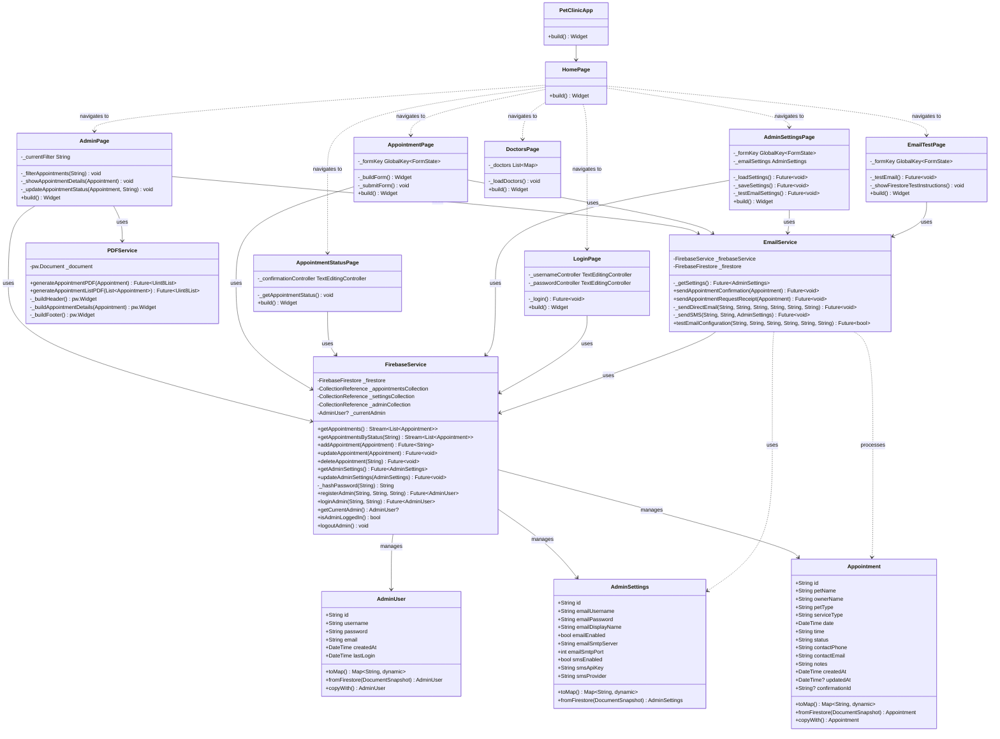

# Pet Clinic Class Diagram

```mermaid
classDiagram
    %% Main Application Classes
    class PetClinicApp {
        +build() Widget
    }
    
    class HomePage {
        +build() Widget
    }
    
    %% Models
    class Appointment {
        +String id
        +String petName
        +String ownerName
        +String petType
        +String serviceType
        +DateTime date
        +String time
        +String status
        +String contactPhone
        +String contactEmail
        +String notes
        +DateTime createdAt
        +DateTime? updatedAt
        +String? confirmationId
        +toMap() Map~String, dynamic~
        +fromFirestore(DocumentSnapshot) Appointment
        +copyWith() Appointment
    }
    
    class AdminSettings {
        +String id
        +String emailUsername
        +String emailPassword
        +String emailDisplayName
        +bool emailEnabled
        +String emailSmtpServer
        +int emailSmtpPort
        +bool smsEnabled
        +String smsApiKey
        +String smsProvider
        +toMap() Map~String, dynamic~
        +fromFirestore(DocumentSnapshot) AdminSettings
    }
    
    class AdminUser {
        +String id
        +String username
        +String password
        +String email
        +DateTime createdAt
        +DateTime lastLogin
        +toMap() Map~String, dynamic~
        +fromFirestore(DocumentSnapshot) AdminUser
        +copyWith() AdminUser
    }
    
    %% Services
    class FirebaseService {
        -FirebaseFirestore _firestore
        -CollectionReference _appointmentsCollection
        -CollectionReference _settingsCollection
        -CollectionReference _adminCollection
        -AdminUser? _currentAdmin
        +getAppointments() Stream~List~Appointment~~
        +getAppointmentsByStatus(String) Stream~List~Appointment~~
        +addAppointment(Appointment) Future~String~
        +updateAppointment(Appointment) Future~void~
        +deleteAppointment(String) Future~void~
        +getAdminSettings() Future~AdminSettings~
        +updateAdminSettings(AdminSettings) Future~void~
        -_hashPassword(String) String
        +registerAdmin(String, String, String) Future~AdminUser~
        +loginAdmin(String, String) Future~AdminUser~
        +getCurrentAdmin() AdminUser?
        +isAdminLoggedIn() bool
        +logoutAdmin() void
    }
    
    class EmailService {
        -FirebaseService _firebaseService
        -FirebaseFirestore _firestore
        -_getSettings() Future~AdminSettings~
        +sendAppointmentConfirmation(Appointment) Future~void~
        +sendAppointmentRequestReceipt(Appointment) Future~void~
        -_sendDirectEmail(String, String, String, String, String, String) Future~void~
        -_sendSMS(String, String, AdminSettings) Future~void~
        +testEmailConfiguration(String, String, String, String, String, String) Future~bool~
    }
    
    class PDFService {
        -pw.Document _document
        +generateAppointmentPDF(Appointment) Future~Uint8List~
        +generateAppointmentListPDF(List~Appointment~) Future~Uint8List~
        -_buildHeader() pw.Widget
        -_buildAppointmentDetails(Appointment) pw.Widget
        -_buildFooter() pw.Widget
    }
    
    %% Page Classes
    class AppointmentPage {
        -_formKey GlobalKey~FormState~
        -_buildForm() Widget
        -_submitForm() void
        +build() Widget
    }
    
    class AppointmentStatusPage {
        -_confirmationController TextEditingController
        -_getAppointmentStatus() void
        +build() Widget
    }
    
    class AdminPage {
        -_currentFilter String
        -_filterAppointments(String) void
        -_showAppointmentDetails(Appointment) void
        -_updateAppointmentStatus(Appointment, String) void
        +build() Widget
    }
    
    class AdminSettingsPage {
        -_formKey GlobalKey~FormState~
        -_emailSettings AdminSettings
        -_loadSettings() Future~void~
        -_saveSettings() Future~void~
        -_testEmailSettings() Future~void~
        +build() Widget
    }
    
    class DoctorsPage {
        -_doctors List~Map~
        -_loadDoctors() void
        +build() Widget
    }
    
    class LoginPage {
        -_usernameController TextEditingController
        -_passwordController TextEditingController
        -_login() Future~void~
        +build() Widget
    }
    
    class EmailTestPage {
        -_formKey GlobalKey~FormState~
        -_testEmail() Future~void~
        -_showFirestoreTestInstructions() void
        +build() Widget
    }
    
    %% Relationships
    PetClinicApp --> HomePage
    
    HomePage ..> AppointmentPage : navigates to
    HomePage ..> DoctorsPage : navigates to
    HomePage ..> AdminPage : navigates to
    HomePage ..> LoginPage : navigates to
    HomePage ..> AdminSettingsPage : navigates to
    HomePage ..> AppointmentStatusPage : navigates to
    HomePage ..> EmailTestPage : navigates to
    
    AdminPage --> FirebaseService : uses
    AdminPage --> EmailService : uses
    AdminPage --> PDFService : uses
    
    AppointmentPage --> FirebaseService : uses
    AppointmentPage --> EmailService : uses
    
    AppointmentStatusPage --> FirebaseService : uses
    
    AdminSettingsPage --> FirebaseService : uses
    AdminSettingsPage --> EmailService : uses
    
    LoginPage --> FirebaseService : uses
    
    EmailTestPage --> EmailService : uses
    
    FirebaseService --> Appointment : manages
    FirebaseService --> AdminSettings : manages
    FirebaseService --> AdminUser : manages
    
    EmailService --> FirebaseService : uses
    
    EmailService ..> Appointment : processes
    EmailService ..> AdminSettings : uses
``` 