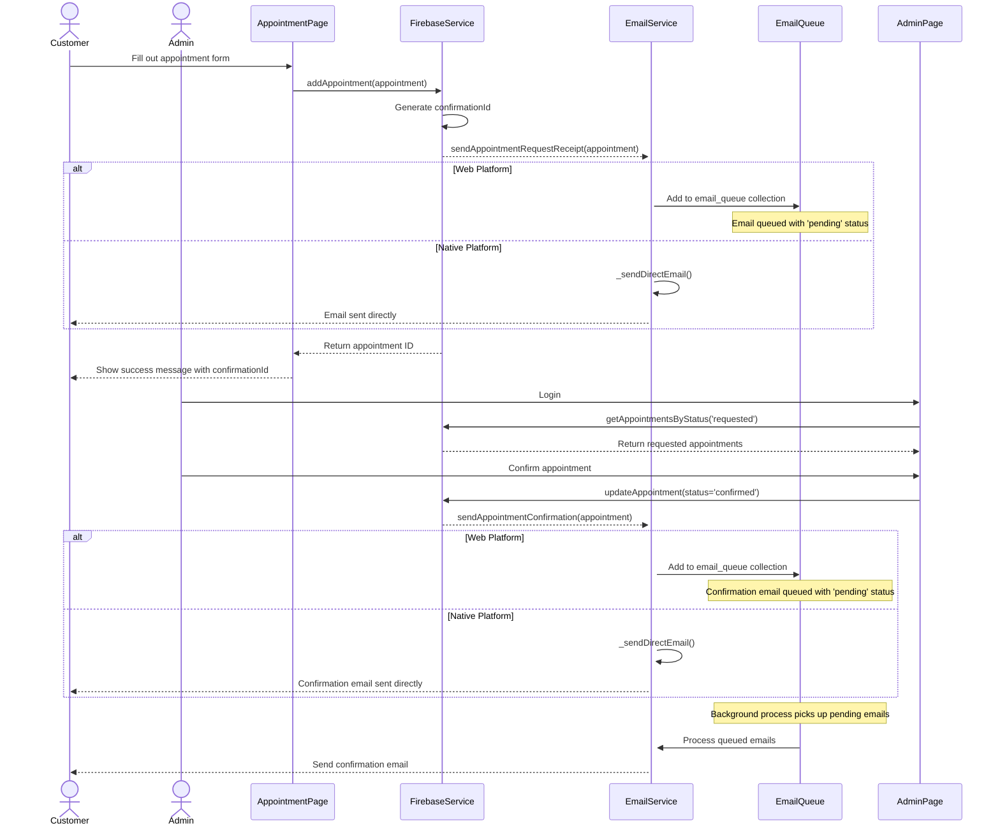

# Pet Clinic Appointment Process Sequence Diagram

```mermaid
sequenceDiagram
    actor Customer
    actor Admin
    participant AppointmentPage
    participant FirebaseService
    participant EmailService
    participant EmailQueue
    
    %% Appointment Request Flow
    Customer->>AppointmentPage: Fill out appointment form
    AppointmentPage->>FirebaseService: addAppointment(appointment)
    FirebaseService->>FirebaseService: Generate confirmationId
    FirebaseService-->>+EmailService: sendAppointmentRequestReceipt(appointment)
    
    alt Web Platform
        EmailService->>EmailQueue: Add to email_queue collection
        Note over EmailQueue: Email queued with 'pending' status
    else Native Platform 
        EmailService->>EmailService: _sendDirectEmail()
        EmailService-->>Customer: Email sent directly
    end
    
    FirebaseService-->>AppointmentPage: Return appointment ID
    AppointmentPage-->>Customer: Show success message with confirmationId
    
    %% Admin Confirmation Flow
    Admin->>AdminPage: Login
    AdminPage->>FirebaseService: getAppointmentsByStatus('requested')
    FirebaseService-->>AdminPage: Return requested appointments
    Admin->>AdminPage: Confirm appointment
    AdminPage->>FirebaseService: updateAppointment(status='confirmed')
    FirebaseService-->>+EmailService: sendAppointmentConfirmation(appointment)
    
    alt Web Platform
        EmailService->>EmailQueue: Add to email_queue collection
        Note over EmailQueue: Confirmation email queued with 'pending' status 
    else Native Platform
        EmailService->>EmailService: _sendDirectEmail()
        EmailService-->>Customer: Confirmation email sent directly
    end
    
    %% Email Queue Processing (background process or cloud function)
    Note over EmailQueue: Background process picks up pending emails
    EmailQueue->>EmailService: Process queued emails
    EmailService-->>Customer: Send confirmation email
``` 