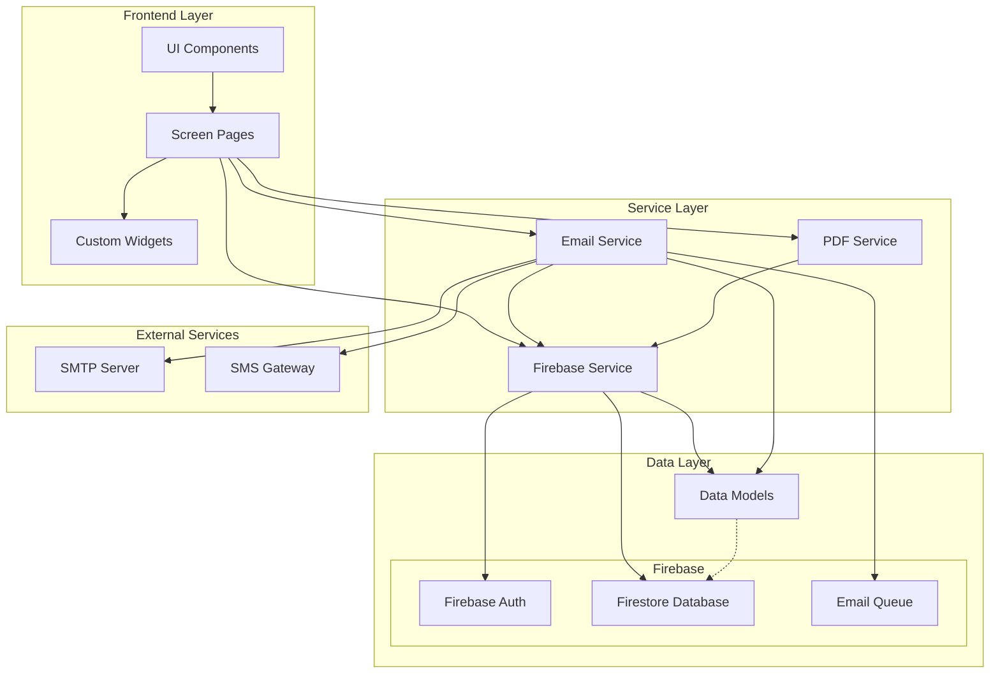

# Pet Clinic System Architecture

## Overview

The Pet Clinic application is built using Flutter for cross-platform compatibility and Firebase for backend services. The architecture follows a service-oriented design pattern with clear separation between UI components, business logic, and data services.

## Component Diagram



## Component Descriptions

### Frontend Layer

- **UI Components**: Core Flutter UI elements used throughout the application
- **Screen Pages**: Main application screens (Home, Appointment, Admin, etc.)
- **Custom Widgets**: Reusable custom widgets specific to the Pet Clinic application

### Service Layer

- **Firebase Service**: Handles all interactions with Firebase, including authentication, data storage, and retrieval
- **Email Service**: Manages email communications, including appointment confirmations and notifications
- **PDF Service**: Generates PDF reports and documents for appointments

### Data Layer

- **Data Models**: Application data structures (Appointment, AdminSettings, AdminUser)
- **Firebase Auth**: Handles administrator authentication
- **Firestore Database**: NoSQL database storing all application data
- **Email Queue**: Collection in Firestore that stores pending emails for web platform compatibility

### External Services

- **SMTP Server**: External email server for sending emails
- **SMS Gateway**: External service for sending SMS notifications

## Key Design Patterns

1. **Singleton Pattern**: Used in service classes to ensure a single instance is shared across the application
2. **Repository Pattern**: Implemented in the Firebase Service to abstract data operations
3. **Adapter Pattern**: Used in the Email Service to handle different platforms (web vs. native)

## Platform-Specific Considerations

### Web Platform

- Direct socket connections for email are not supported in browsers
- Emails are queued in Firestore and processed by a background service
- UI provides additional guidance for web-specific limitations

### Native Platforms (Android, iOS, Desktop)

- Direct email sending is supported
- Enhanced performance with native Flutter widgets
- Full access to platform-specific APIs

## Security Considerations

1. **Authentication**: Admin authentication with secure password hashing
2. **Data Protection**: Firestore security rules restrict access based on user roles
3. **Email Credentials**: Stored securely in Firestore with limited access

## Scalability

The application architecture supports scalability through:

1. **Firestore's horizontal scaling**: Automatically handles increased data load
2. **Queue-based email processing**: Prevents system overload during peak email sending periods
3. **Separation of concerns**: Services can be extended or replaced independently

## Future Enhancements

The architecture is designed to accommodate future enhancements:

1. **Real-time notifications**: Can be added using Firebase Cloud Messaging
2. **Multi-language support**: UI layer is prepared for localization
3. **Advanced analytics**: Firebase Analytics can be integrated with minimal changes
``` 