# Pet Clinic Use Case Diagram

```mermaid
graph TD
    %% Actors
    Customer((Customer))
    Admin((Admin))
    EmailSystem((Email System))
    
    %% Use Cases - Customer
    UC1[Book Appointment]
    UC2[Check Appointment Status]
    UC3[View Doctors]
    UC4[View Pet Details]
    UC5[View Service Details]
    UC6[Request Appointment from Doctor Page]
    
    %% Use Cases - Admin
    UC7[Login to Admin Area]
    UC8[Manage Appointments]
    UC9[Configure Email Settings]
    UC10[Test Email System]
    UC11[Send Email Confirmations]
    UC12[Generate PDF Reports]
    
    %% Email System Use Cases
    UC13[Send Appointment Confirmation]
    UC14[Send Appointment Request Receipt]
    UC15[Queue Emails for Web Platform]
    
    %% Relationships - Customer
    Customer --> UC1
    Customer --> UC2
    Customer --> UC3
    Customer --> UC4
    Customer --> UC5
    Customer --> UC6
    
    %% Relationships - Admin
    Admin --> UC7
    Admin --> UC8
    Admin --> UC9
    Admin --> UC10
    Admin --> UC11
    Admin --> UC12
    
    %% Email System Relationships
    EmailSystem --> UC13
    EmailSystem --> UC14
    EmailSystem --> UC15
    
    %% Dependencies
    UC1 --> UC14
    UC8 --> UC13
    UC9 --> UC15
    UC10 --> UC13
    UC11 --> UC13
```

## Actor Descriptions

### Customer
- Pet owners who use the application to book and manage appointments for their pets

### Admin
- Clinic staff who manage appointments, configure system settings, and send confirmations

### Email System
- The email service infrastructure that handles sending notifications to customers

## Use Case Descriptions

### Customer Use Cases

1. **Book Appointment**
   - Customer enters pet and appointment details to request a new appointment
   - System stores the appointment with "requested" status
   - Customer receives a confirmation receipt

2. **Check Appointment Status**
   - Customer enters their confirmation ID to view their appointment status
   - System displays appointment details and current status

3. **View Doctors**
   - Customer browses the list of veterinarians at the clinic
   - System displays doctor profiles and specialties

4. **View Pet Details**
   - Customer can view and manage their pet's information

5. **View Service Details**
   - Customer can browse available services offered by the clinic

6. **Request Appointment from Doctor Page**
   - Customer can request an appointment directly from a doctor's profile page

### Admin Use Cases

7. **Login to Admin Area**
   - Admin authenticates with username and password
   - System verifies credentials and grants access to admin features

8. **Manage Appointments**
   - Admin can view, confirm, complete, or cancel appointment requests
   - Admin can update appointment details

9. **Configure Email Settings**
   - Admin can set up email credentials and configuration
   - Admin can enable/disable email notifications

10. **Test Email System**
    - Admin can test the email configuration by sending test emails
    - System provides feedback on email delivery status

11. **Send Email Confirmations**
    - Admin can manually trigger email confirmations for appointments
    - System sends formatted emails to customers

12. **Generate PDF Reports**
    - Admin can generate PDF reports for appointments and clinic activity

### Email System Use Cases

13. **Send Appointment Confirmation**
    - System sends confirmation email when appointment status changes to "confirmed"
    - Email includes appointment details and confirmation ID

14. **Send Appointment Request Receipt**
    - System sends a receipt when a customer submits a new appointment request
    - Email acknowledges the request and provides a confirmation ID

15. **Queue Emails for Web Platform**
    - System stores email requests in a Firestore queue for web platform compatibility
    - Background process handles actual email delivery 